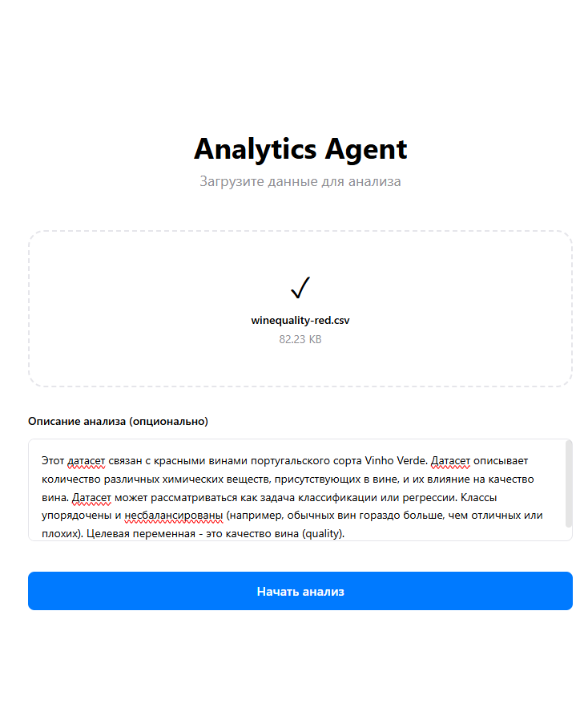
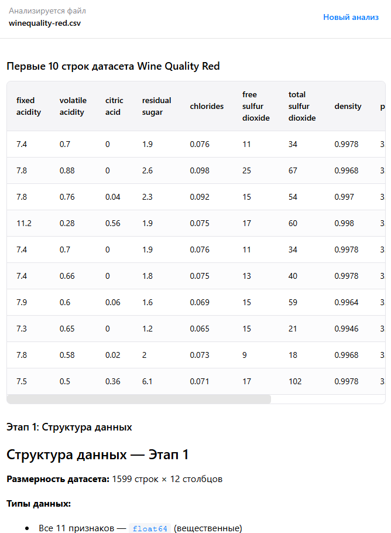
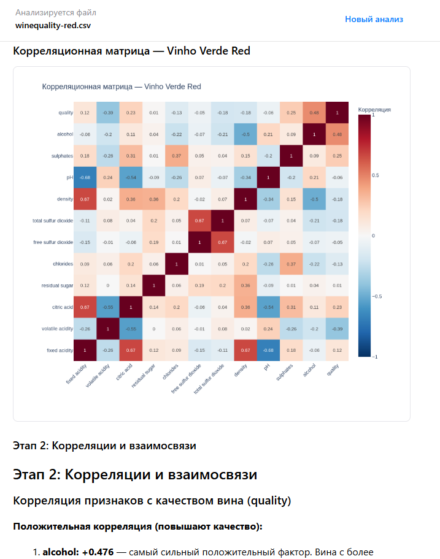

# AnalyticsThirdLab — мини-продукт с LLM-аналитикой

Мини-продукт, где пользователь загружает датасет (CSV), а LLM-агент сам проводит анализ данных через выполнение кода в изолированной среде и возвращает результаты (таблицы, метрики, инсайты, графики).

## Суть проекта

- Веб-интерфейс (React) для загрузки CSV и просмотра результатов в реальном времени.
- Backend (FastAPI) запускает агентный анализ и стримит артефакты через SSE.
- Агент выполняет Python-код в Daytona sandbox и отправляет результаты на фронт.

## Агент и пайплайн

- Для агента используется Deep Agents SDK: A package for building agents that can handle any task (пакет от создателей LangChain).
- Агент работает по пайплайну, заданному системным промптом (структура анализа и порядок шагов взяты из 1 лабораторной работы):
  1) структура данных и пропуски
  2) тренды/взаимосвязи (корреляции)
  3) аномалии/выбросы
  4) гипотезы и бизнес-инсайты

## Безопасность

### Проверка prompt injection

Перед каждым запуском анализа датасета текст запроса пользователя (prompt) сначала отправляется в отдельную instruct-модель, которая возвращает структурированный результат (structured output): является ли текст попыткой prompt injection, уровень уверенности и найденные паттерны.

Если инъекция обнаружена, анализ не запускается: backend возвращает ошибку, а агент не получает запрос на выполнение.

### Изоляция выполнения кода (Daytona sandbox)

Анализ данных выполняется не на сервере backend напрямую, а внутри изолированной песочницы Daytona:

- CSV-файл загружается в sandbox.
- Агент запускает Python-код и читает/пишет файлы внутри файловой системы sandbox.
- Результаты (текст/таблицы) передаются как данные, а изображения графиков сохраняются в sandbox и затем скачиваются backend-ом для отображения на фронте.

Такой подход ограничивает влияние сгенерированного кода: у него нет прямого доступа к файловой системе и коду backend-сервера (за пределами sandbox), поэтому он не может произвольно изменять файлы на сервере приложения.

## Архитектура

### Backend (FastAPI + AI Agent)

- REST endpoint для загрузки данных и старта анализа
- SSE endpoint для потока артефактов в реальном времени
- endpoint для отдачи файлов-артефактов (PNG графики)

Основные endpoints:
- `POST /v1/analyse` — загрузка CSV + (опционально) сообщение пользователя
- `GET /v1/stream/{session_id}` — SSE поток артефактов
- `GET /v1/artifacts/{session_id}/{filename}` — получить PNG артефакт

Swagger: `http://localhost:5030/docs`

### Frontend (React + TypeScript)

- UI для загрузки CSV и просмотра результатов
- Подписка на SSE и рендер артефактов (текст, таблицы, изображения)

## Настройка окружения (Daytona + OpenRouter)

### 1) Регистрация в Daytona

1. Зарегистрируйтесь на https://daytona.io/
2. Получите API key
3. Добавьте ключ в `.env` (см. ниже)

Примечание: в коде используется переменная `DEYTONA_API_KEY`.

### 2) Регистрация в OpenRouter

1. Зарегистрируйтесь на https://openrouter.ai/
2. Создайте API key
3. Добавьте ключ в `.env` (см. ниже)

### 3) Настройка моделей (2 модели)

В `.env` нужно указать две модели:

1. `OPENROUTER_MODEL` — основная модель агента (reasoning), которая выполняет анализ и управляет шагами пайплайна.
2. `OPENROUTER_INSTUCT_MODEL` — instruct-модель, которая умеет structured output (используется для проверки prompt injection).

## Конфигурация `.env`

Скопируйте `.env.example` в `.env` и заполните значения:

```env
# Daytona
DEYTONA_API_KEY=your_daytona_api_key_here

# OpenRouter
OPENROUTER_API_KEY=your_openrouter_api_key_here

# Models
OPENROUTER_MODEL=xiaomi/mimo-v2.5
OPENROUTER_INSTUCT_MODEL=qwen/qwen3-235b-a22b-2507

# (опционально)
OPENROUTER_BASE_URL=https://openrouter.ai/api/v1
```

Важно: не коммитьте `.env` с реальными ключами.

## Запуск через Docker 

```bash
docker-compose up -d
```

После запуска:
- Frontend: `http://localhost:3000`
- Backend: `http://localhost:5030`
- Swagger: `http://localhost:5030/docs`


## Как работать

1. Откройте `http://localhost:3000`
2. Загрузите CSV файл
3. (Опционально) Добавьте текст: что именно хотите узнать из данных
4. Нажмите запуск анализа
5. Смотрите артефакты по мере готовности

# Скриншоты работы приложения:

## Начальный экран - здесь происходит загрузка датасета, добавление промпта.


## Результат работы приложения:




