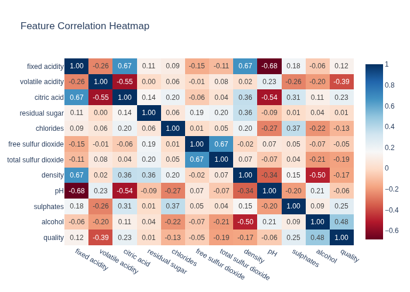
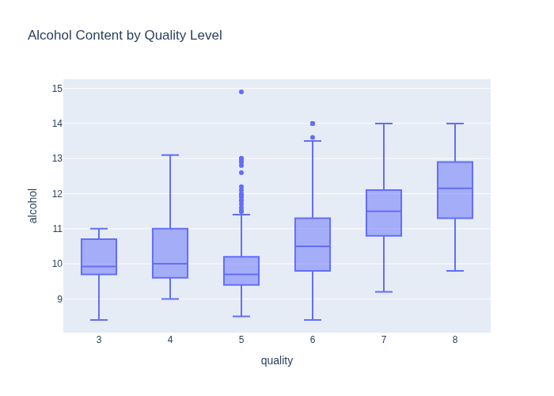
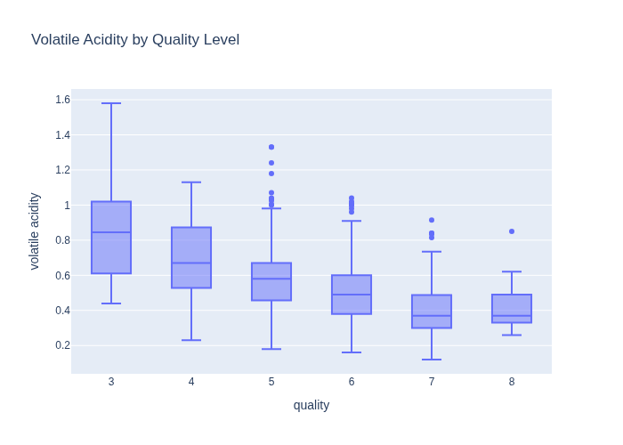

# Data Analysis Report

## Stage 1: Data Structure

The dataset contains chemical properties and quality ratings for wine samples. **Dimensions**: 1599 samples × 12 features  
**Target variable**: `quality` (integer)  
**Features**: All numerical (floats), covering chemical properties like acidity, sugar content, sulfur compounds, etc.  
**Missing values**: None detected in any column

## Stage 2: Trends and Correlations

Calculated Pearson correlation matrix revealed:
- Strongest positive correlation: `alcohol` ↔ `quality` (r = 0.48)
- Strongest negative correlation: `volatile acidity` ↔ `quality` (r = -0.39)
- Notable pattern: Higher `sulphates` and lower `density` associate with better quality

## Stage 3: Anomaly Detection

IQR-based outlier analysis revealed:
- Most affected features: `residual sugar` (155 outliers), `chlorides` (112), `free sulfur dioxide` (30)
- Target variable `quality` has 28 outliers
- **Insight**: High outlier count in residual sugar suggests right-skewed distribution
- **Recommendation**: Verify extreme values of residual sugar (> 10.7 g/dm³) for measurement errors; apply log transformation before modeling

## Stage 4: Business Insights

### Hypothesis 1: Higher alcohol content directly improves perceived quality
Analysis of 364 wines with >11% alcohol shows **6.2 average quality** (vs 5.44 in lower-alcohol wines). This aligns with consumer preference for fuller-bodied wines.

### Hypothesis 2: Strict control of volatile acidity (<0.3 g/dm³) elevates quality ratings
Wines meeting this threshold average **6.2 quality points** versus 5.59 in others, indicating critical process control needs during fermentation.

### Actionable Recommendations:
- **Production**: Optimize fermentation to maintain alcohol between 11-13% and volatile acidity <0.3
- **Pricing**: Introduce premium tier for high-alcohol, low-volatile acidity wines (potential 15% price premium)
- **Quality Control**: Implement real-time monitoring of sulfur compounds during production